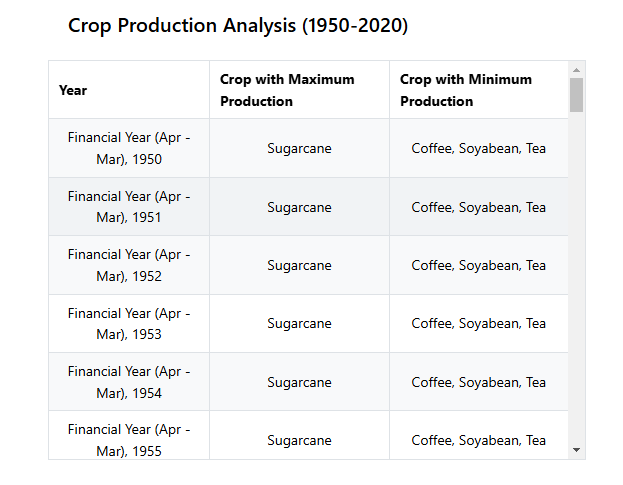
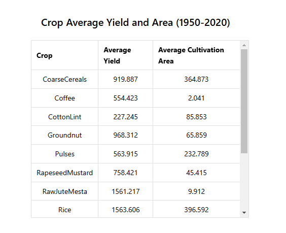

# Vite Minimal Template with React and Mantine

This project is a **Vite-based template** for building React applications with TypeScript. It incorporates the Mantine library for UI components, hooks, and styling, along with linting and TypeScript configuration for a clean development experience.

---

## Screenshots

Here are a couple of screenshots of the application:

### Table 1



### Table 2



---

## Prerequisites

Before starting, ensure you have the following installed:

- **Node.js**: Version 16 or higher.
- **Yarn**: Version 1.x or 4.x (specified in `packageManager`).

---


## Getting Started

Follow these steps to set up and run the project locally:

### 1. Clone the Repository

```bash
git clone [Link](https://github.com/visak14/maunfac)
cd maunfac


### 2. Install Dependencies
 
 ```bash
 yarn install

-------------

### 3. Development Server

 ```bash
 yarn dev

The app will be available at [Link](http://localhost:5173)

 ### 3. Build for Production (Optional)

 ```bash
 yarn build

 This step is not mandatory for development, but it will create a production-ready build in the dist folder.
